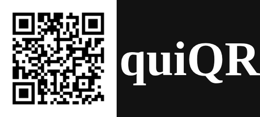

<a id="readme-top"></a>
[](LICENSE)


<!-- PROJECT LOGO -->
<br />
<div align="center">
  

<h3 align="center">quiQR</h3>

  <p align="center">
    Create QR codes in the browser.
    <br />
    <a href="https://github.com/winkt0/quiQR/issues/new?labels=bug&template=bug-report---.md">Report Bug</a>
    &middot;
    <a href="https://github.com/winkt0/quiQR/issues/new?labels=enhancement&template=feature-request---.md">Request Feature</a>
  </p>
</div>


<!-- TABLE OF CONTENTS -->
<details>
  <summary>Table of Contents</summary>
  <ol>
    <li>
      <a href="#about-the-project">About The Project</a>
    </li>
    <li>
      <a href="#getting-started">Getting Started</a>
      <ul>
        <li><a href="#prerequisites">Prerequisites</a></li>
        <li><a href="#installation">Installation</a></li>
      </ul>
    </li>
    <li><a href="#contributing">Contributing</a></li>
    <li><a href="#license">License</a></li>
  </ol>
</details>


<!-- ABOUT THE PROJECT -->
## About The Project

Problem: sending links or text to your phone. Solution: this.

<p align="right">(<a href="#readme-top">back to top</a>)</p>


<!-- GETTING STARTED -->
## Getting Started

All you need to do is add the extension locally as shown below.

### Prerequisites

You only need bun and a Chromium-based browser. If you're on Mac or Linux, run the following command in the terminal to install Bun:
  ```sh
  curl -fsSL https://bun.com/install | bash
  ```

### Installation

1. Clone the repo and cd into it
   ```sh
   git clone https://github.com/winkt0/quiQR.git
   cd quiQR
   ```
2. Install all dependencies & reate the folder 'dist' by running
   ```sh
   bun install
   bun run build
   ```
4. In your browser, go into extensions (e.g. by link: "vivaldi:extensions"), click "Load unpacked" and select the dist folder you just created

That's it! quiQR should now be added as a popup in your extension bar.

<p align="right">(<a href="#readme-top">back to top</a>)</p>


<!-- CONTRIBUTING -->
## Contributing

Contributions are what make the open source community such an amazing place to learn, inspire, and create. Any contributions you make are **greatly appreciated**.

If you have a suggestion that would make this better, please fork the repo and create a pull request. You can also simply open an issue with the tag "enhancement".
Don't forget to give the project a star! Thanks again!

1. Fork the Project
2. Create your Feature Branch (`git checkout -b feature/AmazingFeature`)
3. Commit your Changes (`git commit -m 'Add some AmazingFeature'`)
4. Push to the Branch (`git push origin feature/AmazingFeature`)
5. Open a Pull Request

<p align="right">(<a href="#readme-top">back to top</a>)</p>


<!-- LICENSE -->
## License

Distributed under the MIT license. See the file `LICENSE` for more information.

<p align="right">(<a href="#readme-top">back to top</a>)</p>
